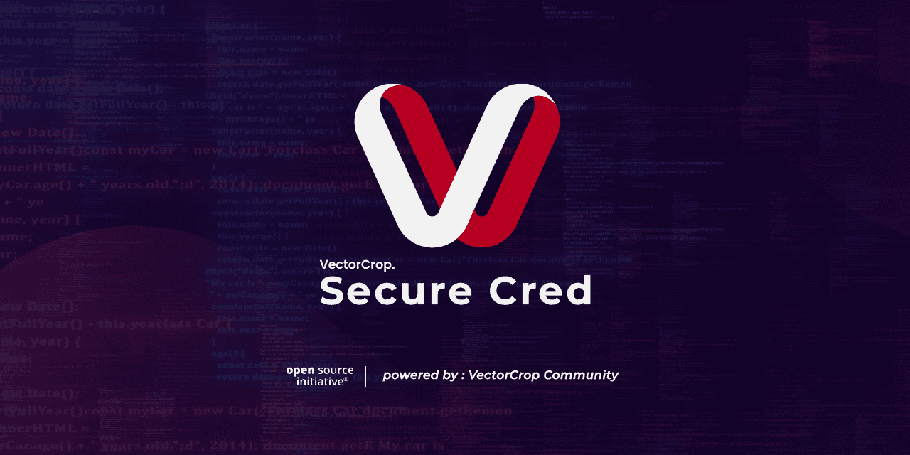

🔥🚀🔒 **SecureCred - Protecting Your Passwords!** 🔒🚀🔥

[](#)
[](#)
[](#)
[](#)
[](#)
[](#)



## SecureCred - The Shield for Your Passwords! 🛡️🔒

SecureCred is an open source project that provides a secure solution for both developers and regular users who need a reliable place to store their passwords. 😎🔐 Whether you have multiple accounts across various platforms or you're a developer with numerous project-related accounts, SecureCred has got your back! No more hassle when handing over credentials to clients during project deployment.  Say goodbye to storing passwords in insecure places like sticky notes or your browser. SecureCred is here to save the day! 🦸‍♂️🔒💪

### Features ✨🔒

- 🏗️ Structural Way
- 🔐 Advanced Encryption

##### Structural Way 📊🔒

SecureCred is designed to efficiently handle multiple application password fields with the following structure:

- It starts with a default category called "Personal," where you can store all your credentials.
- Customize your experience by creating custom categories according to your preferences.
- Within each category, applications and websites are grouped in ascending order for easy management.

##### Advanced Encryption 🔐🔒

SecureCred ensures a high level of security for your stored credentials. It employs advanced encryption algorithms, making it a reliable choice for protecting sensitive data. When you submit a new entry, the password is encrypted using cutting-edge algorithms and securely stored. Your passwords are in safe hands! 💂‍♂️🔒🔐

🎉🤝 **Contribution Guide - Join the SecureCred Community!** 🤝🎉

We appreciate your interest in contributing to SecureCred! Together, we can make password security even better! Here's how you can get involved:

## How to Contribute 🙌🌟

1. Fork the SecureCred repository to your GitHub account.
2. Clone the forked repository to your local machine.

   ```
   git clone https://github.com/YourUsername/SecureCred.git
   ```

3. Create a new branch for your feature or bug fix.

   ```
   git checkout -b feature/your-feature-name
   ```

4. Make the necessary changes and improvements to the codebase.
5. Test your changes thoroughly.
6. Commit your changes with descriptive commit messages.

   ```
   git commit -m "Add feature/fix for XYZ"
   ```

7. Push your changes to your forked repository.

   ```
   git push origin feature/your-feature-name
   ```

8. Open a pull request from your forked repository to the main SecureCred repository.
9. Provide a detailed description of your changes in the pull request.
10. Wait for the project maintainers to review your contribution.

Congratulations! You have made your contribution to SecureCred! Thank you for helping us improve password security for everyone! 🚀🔒🤝

## Code Style Guidelines 🌟📝

To maintain consistency throughout the project, please follow these code style guidelines:

- Use meaningful variable and function names.
- Write clear and concise comments.
- Format your code properly and adhere to the existing code style.
- Write unit tests for new features or bug fixes whenever possible.
- Keep the codebase clean and free of unnecessary dependencies.

## Community and Communication 🌍💬

Join our community and stay connected with other contributors:

- Join our [WhatsApp](https://chat.whatsapp.com/LrJBCBUg1czLVr0oSvVXy6) group to chat with other community members and get help.
- Participate in discussions and share your ideas on our [GitHub Discussions](https://github.com/VectorCropCommunity/SecureCred/discussions) page.

We value your feedback and ideas. Together, we can create a more secure and user-friendly password management solution! 🙌🔒💪

#### Frameworks 🛠️

[](#)
[](#)

#### Links 🔗

[](https://www.figma.com/file/I10VRUqyXnNIwdVxrLTSjT/SecureCred-UI?type=design&node-id=0-1&t=tEyDPLQzOh5zBsgD-0)
[](https://github.com/VectorCropCommunity/SecureCred)

[](#)
[](#)
[](#)

Secure your passwords with SecureCred today! Available on Android and iOS. Download now and experience password peace of mind! 🗝️🔒📲

## License 📜

SecureCred is released under the [MIT License](LICENSE). By contributing to this project, you agree to make your contributions available under this license.

Let's make password security a top priority! Happy contributing! 🎉🔒🚀
